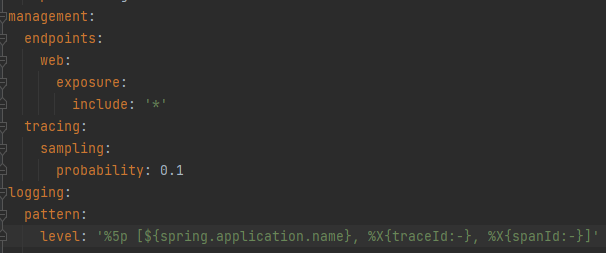

# Eureka Server with Open Feign: (Spring Cloud Netflix Eureka)
Dans ce cas on peut avoir un Spring cloud load balancing
***
# API Gateway
* Il se trouve entre le client et les APIs avec lesquels il veut communiquer
* il permet donc de router la requête
* de faire du load balancing
* security, monitoring, rate limiting ...
* On peut configurer les routes dans le fichier application.yml 
* 
* ou toujours dans ce fichier faire discovery.locator.enabled: true (voir img + debug)
* 
***
# Spring Cloud Config Server
* evite de refaire un build et restart un micro service
* une seule place pour heberger les configs (ex: git) mettre dans ce projet 
* mettre le fichier properties avec le meme nom que le name du client (le name n'est pas obligatoire dans git ) 
* Pour l'exploiter mettre dans les projets clients: actuator et spring cloud config client
* dans le projet client 
* On peut faire du refresh (pour cela activer management.endpoints.web.exposure.include=* sur le props du client)
* changer la config dans git puis commiter
* ensuite faire un post sur http://localhost:8080/actuator/refresh et c bon avec le 200
***
* AUTO REFRESH with spring cloud bus et un broker (Rabbit Mq ou Kafka)
* ajouter **spring-cloud-starter-bus-amqp** dans les api clients
* lancer docker rabbit mq avec:  docker run --rm -it -p 5672:5672 rabbitmq
* dans les api client ajouter spring.rabbitmq.host.. 
* faire POST sur http://localhost:8080/actuator/busrefresh  **busrefresh**pour valider les maj des config qui se trouvent sur git
* (il va faire les maj de tous les config des APIs qui ont été changé tandis que http://localhost:8080/actuator/refresh  **refresh** ne change que l'API qui roule sur ce port)
***
# Spring Cloud Sleuth and Zipkin
* Utiliser pour tracer les logs suivant plusieurs APIs
* Il utilise un trace id commun à tous les APIs et un span id propre à chaque API
* **micrometer-observation** dependency will allow us to collect and report metrics from our application to Zipkin.
* **micrometer-tracing-bridge-brave** dependency will allow us to trace our spring boot application.
* **zipkin-reporter-brave** dependency allows us to send traces that we collect to Zipkin.
* **feign-micrometer** dependency was added because I am using feign in my microservices to call other APIs. This dependency will configure micrometer to work with feign.
* 
* ajouter dans fic props 
* start docker zipkin with: docker run --rm -it --name zipkin -p 9411:9411 openzipkin/zipkin
* pour spring boot > a 3 mettre les dependances dans gateway 
* et la dépendance sleuth dans gateway, departement et employee service 
* ajout dependance zipkin et props dans les 3 services (gateway, employee, department)
***
# Circuit breaker 
* ajouter dependance (on avait deja la dependance actuator) 
* ajouter l'annotation à la méthode qui doit supporter le circuitbreaker (en utilisant webclient) 
* la méthode de fall back avec meme signature (ce qui est retourné si l'api department ne répond pas) 
* et puis la config dans le fic props (managment...) 
## Cicuitbreaker retry
* mettre l'@ retry à la methode 
* ajouter la config dans props (resilience..) 
* 